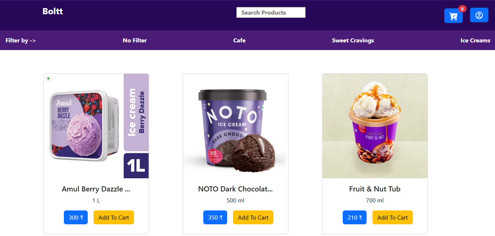
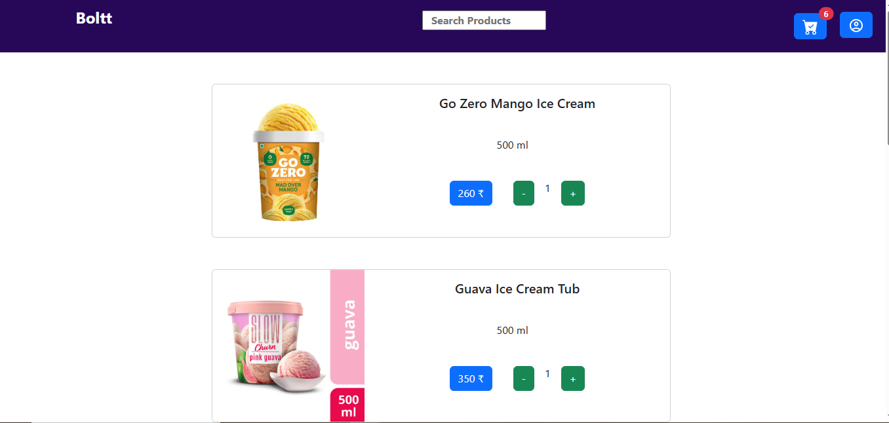

# 🛒 Quick Commerce

A full-stack e-commerce web application built with the **MERN Stack** (MongoDB, Express, React with Vite, Node.js). This project enables users to browse products, manage carts.

🌐 **Live Demo**: [https://quick-commerce-frontend.onrender.com](https://quick-commerce-frontend.onrender.com)

---

## 🛠️ Tech Stack

**Frontend**:
- React (with Vite for fast build)
- Tailwind CSS 
- Axios

**Backend**:
- Node.js
- Express.js

**Database**:
- MongoDB (using Mongoose)

**Deployment**:
- Frontend: [Render](https://render.com/)
- Backend: [Render](https://render.com/) 
- Database: MongoDB Atlas

---

## 📦 Features

- User authentication (Login/Register)
- Product listing with categories
- Add to cart / Remove from cart
- Checkout functionality


---

## 🚀 Getting Started

### Prerequisites

- Node.js (v18 or higher recommended)
- MongoDB account or local MongoDB
- Git

---

### 🖥️ Installation Steps

1. **Clone the repository**

```bash
git clone https://github.com/yourusername/quick-commerce.git
cd quick-commerce
````

2. **Setup Backend**

```bash
cd backend
npm install
# Create .env file (see Environment Variables section)
npm run dev
```

3. **Setup Frontend**

```bash
cd ../frontend
npm install
npm run dev
```

---

## 🔐 Environment Variables

Create a `.env` file in the `backend/` directory and add:

```
PORT=5000
MONGO_URI=your_mongodb_connection_string
JWT_SECRET=your_jwt_secret
```


---

## 📁 Folder Structure

```
quick-commerce/
├── backend/
│   ├── controllers/
│   ├── models/
│   ├── routes/
│   ├── middleware/
│   └── server.js
├── frontend/
│   ├── src/
│   │   ├── components/
│   │   ├── pages/
│   │   └── App.jsx
└── README.md
```

---

## ✅ TODO / Future Enhancements

* Payment gateway integration (e.g., Stripe)
* Order history
* Product reviews
* Admin dashboard for product management
* Improved UI/UX

---

## 📸 Screenshots




---

## 🙋‍♂️ Author

* **Vishwadipsinh Rana** – [GitHub](https://github.com/vishwadipsinh)

---


